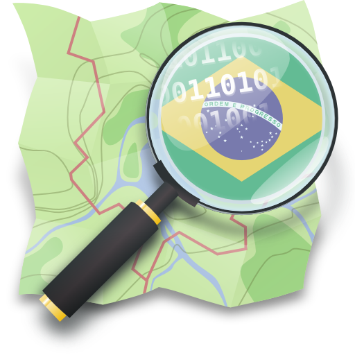
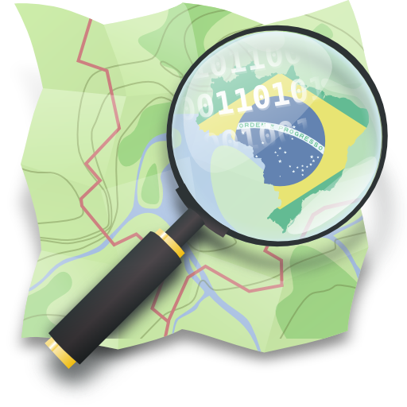
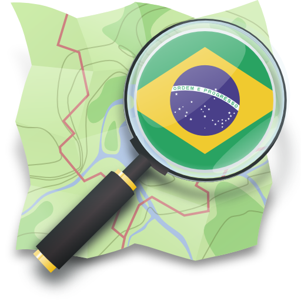

graphics
========

Logos e materias gráficos da comunidade OpenStreetMap no Brasil.

All files are licensed under the [Creative Commons Attribution-Share 
Alike 2.0 Generic license](https://creativecommons.org/licenses/by-sa/2.0/deed.en).
